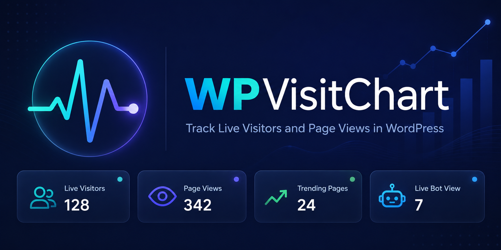

# WP VisitChart

**Self-hosted, Chartbeat-inspired live analytics plugin for WordPress.**

WP VisitChart is a self-hosted WordPress plugin for real-time traffic analytics. It shows live visitor counts, today's traffic graph compared to the same weekday last week, traffic sources, device breakdown, trending articles, and per-post pageview tracking — all without any third-party services or subscriptions. Data never leaves your own server.

## Features

- 📊 Live visitor count with automatic 10-second refresh
- 📈 Today's traffic graph (5-minute intervals) vs. same weekday last week
- 🔥 Trending badge for fast-rising articles
- 🌍 Traffic source breakdown (Direct, Search, Social, Other) with UTM + fbclid detection
- 📱 Device breakdown (Mobile, Tablet, Desktop)
- ⏱️ Average time on site
- 🤖 Bot detection and filtering
- 📰 Per-post pageview column in the Posts/Pages admin list (real-time, no cron)
- 📲 Bookmarkable mobile page (no login required)
- 🔔 Live visitor count in the WordPress admin bar
- ⚙️ Settings to toggle all major features on/off, including exclusion of logged-in users
- 🌐 Fully translatable (Danish + English included)

## Requirements

- WordPress 5.8+
- PHP 7.4+
- MySQL 5.7+ / MariaDB 10.3+

## Installation

1. Download `wp-visitchart.zip` from [Releases](../../releases)
2. In WordPress admin: **Plugins → Add Plugin → Upload Plugin**
3. Activate the plugin
4. Go to **WP VisitChart** in the left admin menu

## Documentation

- 🇬🇧 [User Manual (English)](wp-visitchart-user-manual.md)
- 🇩🇰 [Brugermanual (Dansk)](wp-visitchart-brugermanual.md)

## License

This project is released into the public domain under [The Unlicense](LICENSE).

## Author

Jens E. Hummelmose — Copyright © 2026
